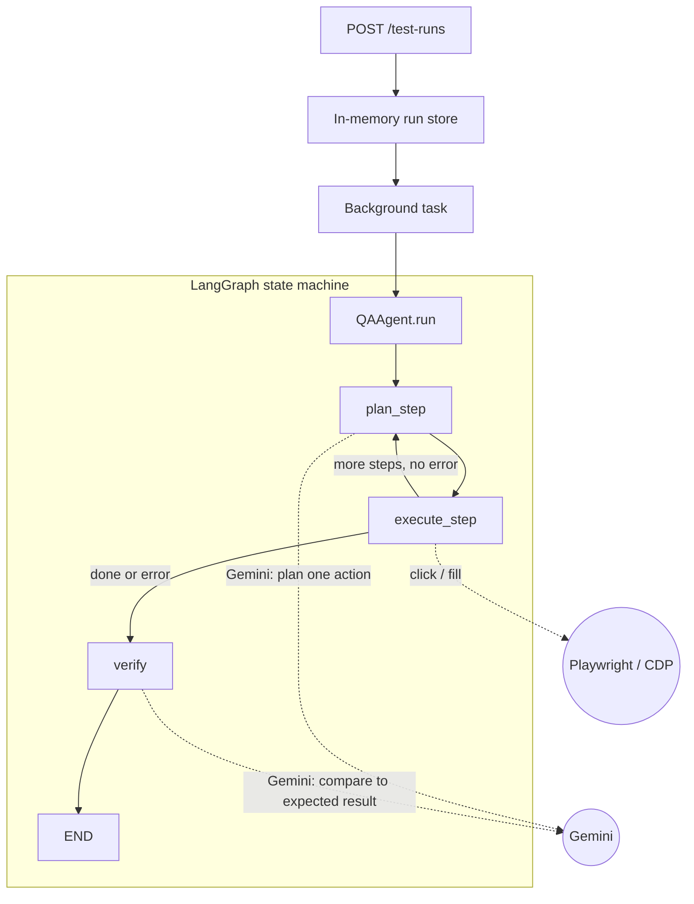

# QA Test-Execution Agent

A LangGraph agent that takes a natural-language test case — the shape a Jira/Zephyr ticket would have — drives a real browser via Playwright to execute it step by step, and verifies the outcome against an expected result. Exposed over an async FastAPI service with a small custom-built dashboard on top.

Built as a portfolio project targeting roles that combine agent orchestration (LangGraph/LangChain) with browser automation and QA tooling (CDP, async Python, Docker, Pytest).

## What it does

Give it a test case like:

- **Start URL:** `https://practicetestautomation.com/practice-test-login/`
- **Steps:** `Enter 'student' into the username field`, `Enter 'Password123' into the password field`, `Click the submit button`
- **Expected result:** `The page shows a success message confirming the login worked`

The agent plans one browser action per step (grounded in the page's actual visible text), executes it via Playwright, and once all steps are done, asks the model to verify the final page state against your expected result — returning a pass/fail verdict with a plain-English reason, a per-step log, and timing/token metrics.

## Architecture



- **`plan_step`** — sends the current step + the page's visible text to Gemini, gets back a single `{action, selector, text}` instruction, validated against a strict Pydantic schema.
- **`execute_step`** — runs that action through Playwright. If the guessed selector fails, it tries a short list of common fallback selectors before giving up on that step.
- **`verify`** — once all steps are done (or a step failed), asks Gemini to compare the final page text against `expected_result`.
- **`GET /test-runs/{id}`** — poll for status, per-step results, timing, and the verdict.

## Features

- **Async FastAPI backend** with background execution, a bounded in-memory run store, and per-server concurrency limiting (`MAX_CONCURRENT_RUNS`).
- **Custom-built dashboard** at `/ui` — no framework, one self-contained HTML file. Shows a live elapsed timer while a run is in progress, per-step duration, and final LLM call/token counts once done.
- **Security hardening**: SSRF protection on `start_url` (blocks localhost/private IPs, resolves DNS and checks the address is genuinely public before ever navigating there), `TrustedHostMiddleware`, optional `X-API-Key` auth, basic security response headers.
- **Real browser automation** via Playwright/Chromium (CDP), not a mocked or simulated DOM.
- **Test suite** with the LLM and browser fully mocked — runs in under a second, no API key or network needed, and specifically covers the failure paths (malformed LLM output, an unrecognized planner action, a browser action failing, an unreachable/private `start_url`).
- **Docker + Docker Compose** for a portable, one-command run.

## Tech stack

Python · LangGraph · LangChain · FastAPI · Pydantic · Playwright · Google Gemini (`langchain-google-genai`) · Docker · Pytest

## Running it

### Docker (recommended — closest to how this would actually be deployed)

```bash
git clone https://github.com/kanishka18-bee/qa-test-execution-agent.git
cd qa-test-execution-agent/qa-agent
cp .env.example .env   # add your GEMINI_API_KEY
docker compose up --build
```

Open `http://localhost:8000/ui`.

### Local / Windows

Playwright launches Chromium as a subprocess, which on Windows requires the `ProactorEventLoop` — the standard `uvicorn ... --reload` CLI sets up its event loop before this can be configured, so this project runs through a small `run.py` entry point instead, which sets the correct policy first:

```powershell
python -m venv venv
venv\Scripts\Activate.ps1
pip install -r requirements-dev.txt
playwright install chromium
copy .env.example .env   # add your GEMINI_API_KEY
python run.py
```

Open `http://localhost:8000/ui`. (On macOS/Linux, plain `uvicorn app.main:app --reload` works fine, since this event-loop issue is Windows-specific.)

### Tests

```bash
pytest -v
```

11 tests, fully mocked — no API key, no network, no real browser required.

## Configuration

All via `.env` (see `.env.example`):

| Variable | Purpose |
|---|---|
| `GEMINI_API_KEY` | Your Gemini API key |
| `GEMINI_MODEL` | Which model to use (see Model selection below) |
| `HEADLESS_BROWSER` | Run Chromium headless (`true`) or visibly (`false`) |
| `API_KEY` | Optional `X-API-Key` auth on the API; unset disables it |
| `ALLOWED_HOSTS` | Hostnames the FastAPI app itself will accept requests for |
| `ALLOWED_URL_HOSTS` | Optional allowlist restricting which hosts `start_url` may target |
| `MAX_CONCURRENT_RUNS` | How many test runs execute in parallel |
| `MAX_STORED_RUNS` | Cap on the in-memory run store before oldest runs are evicted |
| `BROWSER_TIMEOUT_MS` | Per-selector/navigation wait, in milliseconds |
| `SCREENSHOTS_ENABLED` | Save a screenshot after each browser action |

## Model selection

Free-tier Gemini reliability varies noticeably by model. Rather than guess, this includes `diagnose_gemini.py` — a standalone script that fires several bare requests at a set of candidate models back to back and reports pass rate and latency, independent of the rest of the app:

```
Model                     Pass rate   Avg latency (ok calls)
gemini-3.5-flash-lite     1/5         8.79s
gemini-3.1-flash-lite     5/5         3.48s
gemini-2.5-flash-lite     0/5         n/a
```

Based on this, the project runs on `gemini-3.1-flash-lite`. This isn't a one-time decision — free-tier capacity shifts over time, so `diagnose_gemini.py` is meant to be rerun periodically rather than trusted as a permanent result.

## Known limitations

Being upfront about what this is and isn't:

- **Gemini free-tier reliability varies by model and by hour**, independent of anything in this codebase — `diagnose_gemini.py` exists specifically because this is a real, measured issue, not a hypothetical one. A single test run failing occasionally with a `503`/`504` from Google's side is expected behavior on the free tier, not a bug.
- **The run store is in-memory** — restarting the server loses all run history. Fine for a demo; a real deployment would need Redis/Postgres.
- **The `jira_issue_key` field is a placeholder.** `TestCase` is schema-compatible with a Jira/Zephyr ticket, but nothing actually reads from or writes to Jira yet.
- **Selector-finding is heuristic**, not a general solution: the model guesses one CSS/text selector per step, with a short hardcoded fallback list if that guess fails. It works well on simple, conventional forms; it isn't a robust replacement for purpose-built element-locator strategies.
- **Single-process, single-server** — no queue, no worker pool, no persistence. Appropriate for a portfolio/demo project, not for production QA infrastructure as-is.

## Roadmap

- Eval harness: a small fixed set of test cases (positive, negative, unreachable URL, missing element) run automatically, reporting pass/fail, latency, and token cost per case — in progress.
- Jira integration: fetch a real issue, run it as a test case, post the verdict back as a comment (mocked in tests; the schema is already shaped for this).
- Multi-model fallback: if the primary Gemini model fails or times out, automatically retry the same call against a secondary model rather than failing the whole run. Natural next step once the eval harness can measure which fallback ordering actually helps.
